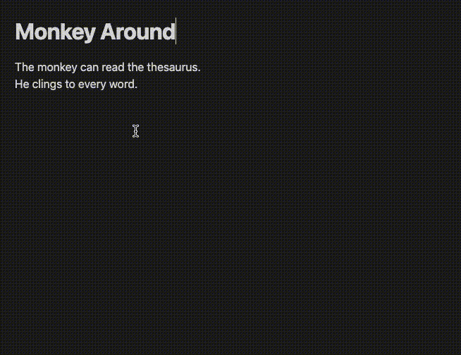

# Wordy
Find synonyms and more using the [Datamuse API](https://www.datamuse.com/api/). This is an [Obsidian](https://obsidian.md/) plugin.

# Demo

# Usage
Select a word, run the `Wordy: Synonyms` command, find a replacement. Current commands are

 - `Wordy: Synonyms` — Find words that have a similiar meaning
 - `Wordy: Rhymes` — Find rhymes for a highlighted word
 - `Wordy: Alliterative Synonyms` — Find alliterative synonyms. Run on `food` and transform `Good food` to `Good grub`
 - `Wordy: Antonyms` — Find words that mean the opposite of the highlighted word

**Tip: Set a hotkey for this command.**

# Changelog
## 1.1.0
- Adds `Wordy: Alliterative Synonyms` command. `good food` to `good grub`
- Adds `Wordy: Rhymes` command.
## 1.0.1
- Adds `Wordy: Antonyms` command. 
- Code refactoring and strict typescript enabled.
## 0.1.0
- Adds `Wordy: Synonyms` command to the palette. Select a word and run the command to pull up synonyms. This list includes hypernyms, hyponyms, holonyms and meronyms.

# Roadmap
I like to write poetry. One day composing a text message poem I asked myself "What word starts with 'P' and is a synonym for 'Beauitful'?" Our goal is to map the [Datamuse API](https://www.datamuse.com/api/) in an aggregate way. For example, when searching for synonyms — hypernyms and homonyms are also included.
- [ ] Write e2e tests
- [ ] Means like
- [ ] Sounds like
- [ ] Spelled like
- [ ] jja	Popular nouns modified by the given adjective, per Google Books Ngrams	gradual → increase
- [ ] jjb	Popular adjectives used to modify the given noun, per Google Books Ngrams	beach → sandy
- [x] syn	Synonyms (words contained within the same WordNet synset)	ocean → sea
- [ ] trg	"Triggers" (words that are statistically associated with the query word in the same piece of text.)	cow → milking
- [x] ant	Antonyms (per WordNet)	late → early
- [x] spc	"Kind of" (direct hypernyms, per WordNet)	gondola → boat
- [x] gen	"More general than" (direct hyponyms, per WordNet)	boat → gondola
- [x] com	"Comprises" (direct holonyms, per WordNet)	car → accelerator
- [x] par	"Part of" (direct meronyms, per WordNet)	trunk → tree
- [ ] bga	Frequent followers (w′ such that P(w′|w) ≥ 0.001, per Google Books Ngrams)	wreak → havoc
- [ ] bgb	Frequent predecessors (w′ such that P(w|w′) ≥ 0.001, per Google Books Ngrams)	havoc → wreak
- [x] rhy	Rhymes ("perfect" rhymes, per RhymeZone)	spade → aid
- [x] nry	Approximate rhymes (per RhymeZone)	forest → chorus
- [x] hom	Homophones (sound-alike words)	course → coarse
- [x] cns	Consonant match	sample → simple
- [ ] topics	Topic words: An optional hint to the system about the theme of the document being written
- [ ] md	Metadata flags to determine additional lexigraphical data
	- [ ] Definitions
	- [ ] Parts of speech
	- [ ] Syllable count
	- [ ] Pronunciation
	- [ ] Word frequency
